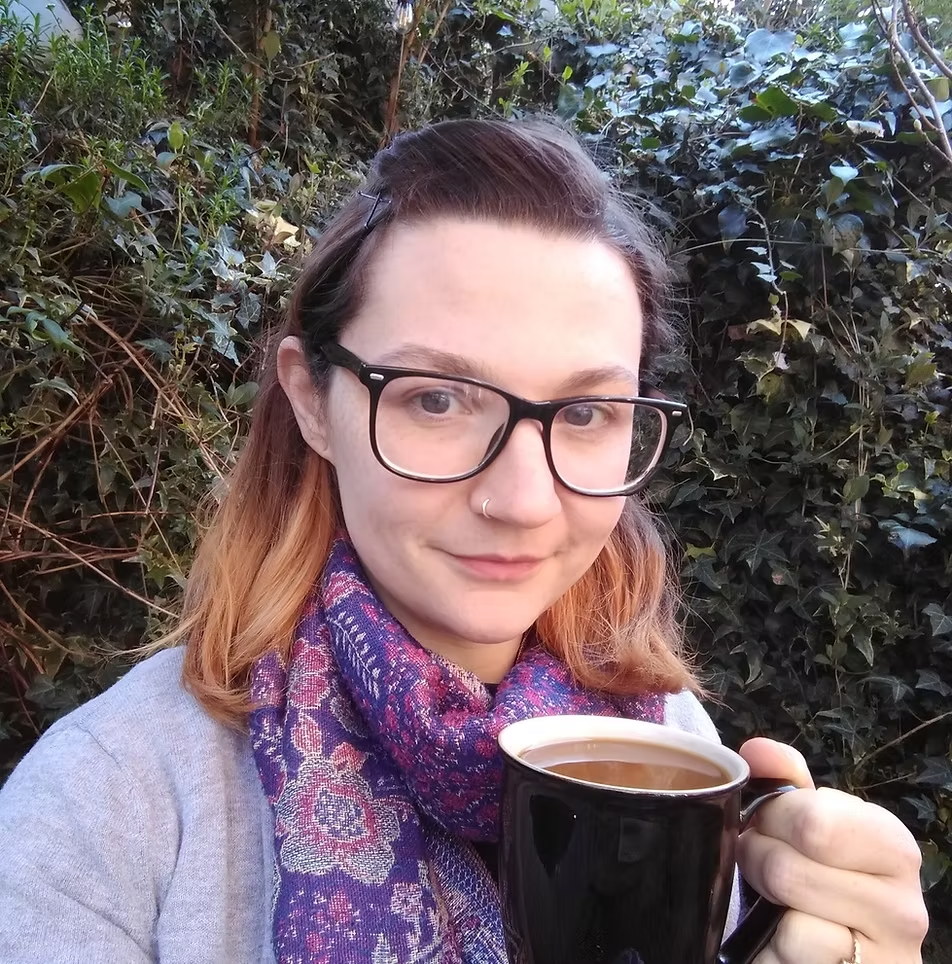

When I support you and your child, you are the centre of the conversation, not me. I am the invisible (hands-off) hands, the listening ears, the admiring eyes. I work hard to ensure that me and my bag of tools are guided by you and your decisions, that I empower and inform so that, ultimately, you and your child are able to choose the right path for you, and feel safe and supported in doing so.

# Hello

I'm Sarah, and I live in Salisbury, Wiltshire (though my Northern accent might say otherwise!) with my partner, our three children and our dog.

​

Our first son was born eight weeks and a day early and spent just shy of four weeks in our local Neonatal Unit. It was then that I learned how difficult, but rewarding, breastfeeding was for us and how different journeys can look from one family to the next, through choice or necessity, and how much good support made an impact.

​

I trained to be a local breastfeeding Peer Supporter, helping others in groups. Then I trained as a Peer Supporter with a national charity and then as a Breastfeeding Counsellor with them, welcoming our second son (our termie) in the middle of studying, after breastfeeding through pregnancy and going on to tandem feed. We recently welcomed our third son, with our first weaning through the pregnancy and our second and third enjoying their tandem journey together.

 

It was through these years of training, volunteering, and responsive parenting that I really developed an understanding of the importance of family-centred support: listening, empowering, and informing. Taking a backseat and hearing what parents wanted to achieve, and helping them to build their unique relationships with their babies.

​

Now as an IBCLC, I look to combine these principles with a strong professional knowledge of lactation and infant feeding.

 

I still have a huge drive to stay up to date, with [recent training](../training) including the UNICEF Baby-Friendly Initiative Breastfeeding and Relationship Building course, and I am still listening, still empowering, still informing, and still placing families at the heart of my care.

[FIND OUT ABOUT THE SERVICES I OFFER >>>](../services)